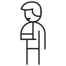

- [Interactive slides](https://pitch.com/v/introduction-to-digital-accessibility-hsve5g) (Pitch)
- [Slides as PDF](/files/introduction-digital-accessibility.pdf) (3 MB)
- [Recording](https://www.youtube.com/watch?v=aTZVdXt9HnQ) (YouTube)

::: Note
The following text was [originally published on the Factorial website](https://www.factorial.io/en/blog/introduction-digital-accessibility).
:::

> The web is for everyone.
>
> — Tim Berners-Lee

Digital accessibility is a growing field of importance that aims to create an inclusive web open for a diverse group of people. Web accessibility has been codified into law in the European Union in 2016 with the Web Accessibility Directive and in 2019 with the European Accessibility Act.

Before we dive into digital accessibility, let’s cover some theoretical groundwork.

## Disabilities and barriers

To understand accessibility needs and requirements, we have to understand the difference between _disabilities_ and _barriers_.

Disabilities are something people have, they’re _intrinsic_ to them. Barriers on the other hand are created by society and imposed onto people, they’re _extrinsic_. Accessibility removes barriers, not disabilities.

### Disabilities

As with people, disabilities come in all shapes and sizes. The following categories are helpful as a summary, but there’s substantial overlap between them and people might fall into more than one:

- Physical disabilities
- Sensory disabilities
- Speech disorders
- Mental disorders
- Developmental disabilities
- Intellectual disabilities

Be mindful that not all disabilities are apparent from looking or talking to a person. While a wheelchair or white cane are visible indicators, disabilities like anxiety, autism, or dyslexia are also called [invisible disabilities](https://en.wikipedia.org/wiki/Invisible_disability).

### Physical barriers

When you next walk through your home town, look out for all the physical barriers that are obstacles to disabled people, for example:

- No curb cuts in crosswalks
- Missing or incorrect tactile paving
- Stairs without ramps or landings
- E-scooters scattered across the sidewalk
- That infamous elevator at the train station that never works

<figure>
  
  <figcaption>High curb without tactile paving (<a href="https://w.wiki/ANeC">source</a>, cropped).</figcaption>
</figure>

<figure>
  
  <figcaption>Curb cut with tactile paving (<a href="https://w.wiki/ANeD">source</a>, cropped).</figcaption>
</figure>

Physical barriers are tangible, making them recognizable by those not familiar with the topic. In some cases, non-disabled people can experience these barriers themselves, think getting a bike up a staircase.

### Digital barriers

Digital barriers can be less obvious and often require some amount of technical knowledge to spot. Some examples are:

- Low color contrast
- Missing alternative text
- Interactive elements without a name
- Videos without captions
- Long loading times

All parties involved in creating a website can introduce barriers, from design to development to content creation. The “[shift left](https://www.deque.com/blog/design-code-thinking-accessibility-ground/)” approach is a mental model for introducing responsibilities early in the process and spread an understanding to each department for digital barriers and how to avoid them.

## The need for accessibility

> We’re all just temporarily abled.
>
> — Cindy Li

About 1 in 4 people have some form of disability, which is over [100 million people in the EU](https://www.consilium.europa.eu/en/infographics/disability-eu-facts-figures/) alone.

To put disabilities into perspective, Microsoft Inclusive Design created the [Persona Spectrum (PDF)](https://web.archive.org/web/20250524155119/https://inclusive.microsoft.design/tools-and-activities/Inclusive101Guidebook.pdf#page=22). This table highlights the different time scales disabilities can have and how everyone can be affected, even those who consider themselves able-bodied.

<!-- markdownlint-disable no-alt-text -->

|           |                           Permanent                           |                             Temporary                              |                                 Situational                                 |
| --------- | :-----------------------------------------------------------: | :----------------------------------------------------------------: | :-------------------------------------------------------------------------: |
| **Touch** |     One arm    |    Arm injury    |        New parent       |
| **See**   |        Blind       |       Cataract       |  Distracted driver |
| **Hear**  |        Deaf        |  Ear infection |         Bartender         |
| **Speak** |  Non-verbal |    Laryngitis    |      Heavy accent     |

<!-- markdownlint-enable no-alt-text -->

## Assistive technology

Disabled people can use [assistive technology](https://en.wikipedia.org/wiki/Assistive_technology) to navigate digital interfaces that would otherwise be inaccessible to them. You may have heard of screen readers, but many more tools and techniques are available depending on disabilities and personal preferences. Multiple assistive technologies can be combined to serve a user’s specific needs.

Examples for assistive technologies include:

### Sensory disabilities

- Screen reader
- Braille display
- Screen magnification and zoom
- Hearing aid
- (Automated) captions

### Physical disabilities

- Voice control
- Keyboard mouse and virtual keyboard
- Switch, joystick, trackball
- Eye tracking
- Smart home devices

### Cognitive disabilities

- Visualization (e.g. mind mapping)
- Time management
- Text-to-speech
- Spelling and grammar check
- Focus and reader mode

Some of these tools might not even be obvious assistive technology at first because of their widespread use by able-bodied people, for example browser zoom, voice control, or smart home devices.

A website needs to follow certain standards to ensure compatibility with assistive technology and a baseline accessible experience. The W3C [Web Accessibility Initiative](https://www.w3.org/WAI/) (WAI) is the driving body behind standardizing web accessibility and publishes, among others, the Web Content Accessibility Guidelines.

## Web Content Accessibility Guidelines

The [Web Content Accessibility Guidelines](https://www.w3.org/TR/WCAG22/) (WCAG) are the de-facto standard for web accessibility. The document lists testable success criteria a website must meet to be considered mostly accessible. The companion [Understanding Docs](https://www.w3.org/WAI/WCAG22/Understanding/) and [Authoring Practices Guide Patterns](https://www.w3.org/WAI/ARIA/apg/patterns/) provide useful developer resources for how to conform to the criteria.

WCAG is structured into four primary sections, also called the POUR principles, which categorize the success criteria:

1. Perceivable
2. Operable
3. Understandable
4. Robust

Each success criteria is assigned one of three conformance levels:

1. Level A: bare minimum, usually not enough to be considered accessible
2. Level AA: baseline required by law
3. Level AAA: highest level, not achievable by all types of content

WCAG Level AA is considered the minimum web developers should aim for. Certain features might not be able to meet Level AAA or even AA. In those cases an alternative needs to be available that provides an equivalent experience. For example a map that can be moved by touch and mouse dragging gestures should also have a search field to jump to a location and keyboard shortcuts for panning.

Keep in mind that following WCAG doesn’t guarantee an accessible website. Real-world testing with assistive technology and disabled users is advised and might be necessary to ensure complex interactive components are actually accessible.

While web developers have been urged to follow WCAG, in practice large portions of the web are still inaccessible, as shown by the [WebAIM Million](https://webaim.org/projects/million/) project. To counteract more and more countries introduce legislation requiring digital accessibility, including the EU.

## EU legislation

Two major EU directives enforce accessibility for websites and other digital interfaces in the member states of the European Union. Many non-EU countries have similar [regulations](https://www.w3.org/WAI/policies/).

### Web Accessibility Directive

The [Web Accessibility Directive](https://en.wikipedia.org/wiki/Web_Accessibility_Directive) has been resolved in 2016 and covers digital products created by the public sector. In Germany this law is known as [BITV](https://bitvtest.de/pruefverfahren/bitv-20-web) (Barrierefreie-Informationstechnik-Verordnung).

The requirements are based on WCAG 2.0 with some additions that go beyond these guidelines.

### European Accessibility Act

Complementing the Web Accessibility Directive, the [European Accessibility Act](https://en.wikipedia.org/wiki/European_Accessibility_Act) (EAA) covers digital products released by the public sector. The EAA became law in 2019, until June 2025 the requirements need to be implemented. The German version of the law is called [BFSG](https://www.bmas.de/DE/Service/Gesetze-und-Gesetzesvorhaben/barrierefreiheitsstaerkungsgesetz.html) (Barrierefreiheitsstärkungsgesetz).

The technical basis for the EAA is EN 301 549 which directly references WCAG 2.1 (soon to be updated to 2.2). This makes WCAG practically the law for all websites operated by private companies with a few exceptions for small businesses.
